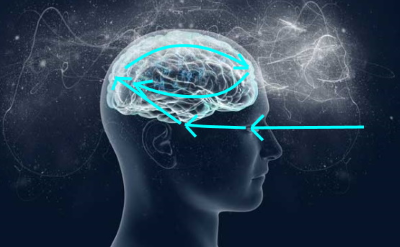

This is a summary of some of my ideas about consciousness. It’s a work in progress.

If you have any suggestions or comments you can find me [here](https://www.reddit.com/user/futuronaut).

### A definition of consciousness

The Wikipedia page about the [hard problem of consciousness](https://en.wikipedia.org/wiki/Hard_problem_of_consciousness) 
starts with this definition:

"The hard problem of consciousness is the problem of explaining why and how sentient organisms have qualia or 
phenomenal experiences - how and why it is that some internal states are felt states, such as heat or pain, 
rather than unfelt states, as in a thermostat or a toaster."

Let’s expand on the concept of phenomenal experience, and take the perception of color as an example. Consider 
the series of pictures below: 

If you have normal color perception you can name the colors in the first picture, and this is accompanied by 
an experience of these colors. You can see the sky is blue because it just _looks_ blue, and this is a 
different experience from seeing the color green in the grass. 

In the second picture we can still see the different colors, but they are less vivid, less intense. We can still tell 
which color is which but they start to look more like each other. 

Now let’s turn the dial a bit further so we end up with a grayscale image. We remember the colors from the previous image, 
and we can use our knowledge of the world to guess which color each part of the picture is, but we can’t tell directly 
anymore. And at the same time our experience of the different colors has disappeared. The thing that gradually disappeared 
in these pictures is our phenomenal experience of color.

Now let’s imagine we could tell all the colors apart in the last image as we could in the first image. We would be a 
color-zombie as we would have no experience of colors but could still tell all the colors apart. If we would extrapolate 
this idea to all our perceptions we would go full zombie and there would not be anything left of ‘what it is like to be’ 
a conscious person. 

This thought experiment is helpful in understanding what we mean by the word consciousness, but it can also lead us to 
seeing consciousness as separate from the other functions of the brain, and thus in need of some exotic explanation. 
I would argue this kind of zombie is not an actual possibility and the conceivability of it cannot be used as an argument.

### The Closed Loop hypothesis

Now how do we explain these inner states, these phenomenal experiences, this what-it-is-like to be someone? If we look 
inside the brain we only see electrical and chemical processes, and the jump to these inner experiences seems impossible 
to make. There seems to be an explanatory gap that we have to bridge because experience seems to be made of a fundamental 
different kind of stuff than the brain.

But let’s look more closely. The brain is a complex, self-referential system, with all kinds of feedback loops, and a 
combination of bottom-up and top-down processing. What if these experiences are just a simple and very normal property 
of such a system, a simple property that is just very easy to overlook? Or in other words - very hard to grasp?

Let us try and understand what is going on. Consider again the perception of color. Light of a certain frequency hits 
the retina, receptors turn this into encoded neuronal spikes which are relayed to the primary visual cortex, and from 
there to the higher order centers in the brain. At a certain point the processing is finished and we have a representation 
of the object we are looking at in our brain. But what happens if we pay attention to this experience of color and we are 
reporting on it? There are connections from the higher order parts of the brain back to the more primary areas, and I would 
argue we use these pathways to pay attention to different experiences, and in doing so we are creating a closed loop. This 
loop is started and is being fed by an external stimulus but it is being activated by top down processes.

By means of these top-down pathways the primary areas get _primed_ as it were so they will react more intensely to stimuli. 
The time it takes to establish such a loop might be around a third of a second as the processing of the perception needs 
time to complete. But we can pay attention to an element of our experience for a longer amount of time and that would 
mean the loop is _reverberating_ in some way: the external stimulus activates the processing, but the top-down connections 
amplify activity in the primary areas. 

Thus focusing our attention on a perception closes the loop and creates an inner experience we can report on. But we still 
need to explain how a closed loop in our brain produces these subjective states. The basic idea is that our phenomenal 
experiences are simply the _inside_ of a closed loop of activity in our brain. 

Let’s make it more general: a complex system that is reporting on its own state has to describe its inner state in a 
certain way. And the way it perceives its own inner state is by the influence of the activity in a part of the system 
on the activity in another part of the system. One could suppose a system would describe its state as we would as an 
outside observer, but this would in fact not be logical since the system does not necessarily know what it is made of 
or has no way of knowing which parts of it are activated. Instead it notices its own activity from the _inside_, and I 
would argue the way the system notices its own state is by having an _experience_ of this state.

In linking conscious experience with attention we seemingly create a problem, what if the loop isn’t closed, does that 
mean there is no conscious experience? Normally if we look at an object and we turn our gaze away, we can assume the 
object is still there and if we look back we see the object again confirming our belief. And we use the same principle 
for our conscious experience, every time we pay attention to a certain experience it is there so we assume it’s always 
there in some way but this intuition might be incorrect.

### Why is it so hard to understand consciousness

In most areas of life, our intuitions help us and give us ways to understand the world around us in a way that is mostly 
congruent with reality. There is evolutionary pressure to make this so since we would be better able to predict the way 
the world behaves if our intuitions are right. But the important part is that our intuitions _work_, not that they are _true_.

In the case of consciousness our intuitions might actually work against us, as it might be the case that it’s not evolutionary 
relevant for us to be able to perceive these properties as normal properties in the outside world. Our brain is the only complex 
self-referential system we know from a first person perspective and it might even be beneficial for our survival to interpret 
these experiences as something that does not necessarily correspond to reality. 

Some even doubt the occurrence of consciousness in animals that are very much like us, and seeing awareness as a general 
physical principle is just not that relevant for us and concepts like a soul or a consciousness separate from the body 
might even help societies form social structures that are helpful. It’s just not a concept we are used to seeing in the 
outside world so we tend to overlook it. What this means is we have to do some work to understand the concept of 
consciousness as our intuitions might be off.

### Leibniz’ mill revisited

In his famous analogy Leibnitz talks about visiting a mill with a machine in it that can think. If we enter the mill 
and look around, he writes, we find only parts that push one another. We will never find anything to explain perception. 
But still this machine acts intelligently and shows signs of consciousness. How is this possible? So this is a very early 
description of the hard problem of consciousness and the explanatory gap as defined much later.

But as reasonable as this sounds, I would claim that this is an example of our faulty intuitions at work, and the 
conclusion that we cannot find consciousness in the process is false. We do have a reason to suppose there is more 
happening than just mechanical activity.

Consider a variation on the thought experiment that Leibnitz came up with. Let's say there is a large factory building 
with a very complex system of pipes and valves, and through these pipes there is water running. By a combination of water 
pressure and closing and opening the valves this machine can do complex computations. It has a type of camera on the outside 
of the building so it can see and process the information it sees. It also has a way of outputting text so people can 
communicate with it. This system can answer questions and it can think about itself. 

Now think about what happens if we ask it about its perceptions. Let's say there is a red fire truck parked in front of 
the building and we ask the machine what color it is. It will answer that the truck is red just like you would expect. 
Now we ask it the question: "How do you know it is red?".

If we ask one of the engineers that works on the machine about this, he will probably answer that there is a flow of 
water pressure from the mechanical camera through the machine that causes different valves to open and close so the 
water pressure in a certain part of the mechanical brain activates the uttering of the word 'Red'. And to him this is 
all there is to say about this.

But what would the machine answer? Maybe it knows about its inner workings and it will answer in a similar vein. But 
it’s important to realize it doesn't have to know about its inner workings. It has a camera that sees the outside, 
there are doors the engineers can use to enter the building but the machine itself can only see the outside world. 
It could have all kinds of ideas about its inner workings but as long as we don't tell it that it is comprised of 
tubes with water it just doesn't know. It also doesn’t know which parts of its machinery is active at any given moment.

It could answer that the idea of red just pops up in its mind. It could answer that it just feels an irresistible urge 
to answer red. It could answer it just doesn't know.  And it could answer the truck just looks red.

I would argue that it would answer that the truck looks red, and that the reason it says that is the same as it would 
be for us. Seeing and experiencing red is the inside of a complex self-referential system that has perceptions and 
the ability to talk about its experiences.

Note that an essential part of this thought experiment is that the machine can talk about its own experiences. This 
means there is a kind of a feedback loop in its inner workings, not just bottom up processing but also top down. It 
can look at its own experiences and report about it. But what does looking at its own experiences mean?

For us the result of seeing red is a higher pressure in a certain tube. Now how can we go from pressure in a tube to 
the experience of red? To do that we have to see the tube as part of a bigger system. The pressure influences other 
parts of the system, and it has a meaning. The pressure travels through the system in a kind of loop, from the sensory 
part to the self-reporting part and back to the lower parts of the processing chain when the system thinks about seeing 
red. This information going around in the system could keep going round even if the machine stops looking at the fire 
truck. So we have something like a wave of pressure going around in the system.

Now suppose a part of the mechanism is damaged and an engineer replaces a pipe with a hydraulic system that relays the 
pressure over some distance. Does this matter for the system? The result is the same, and the influence of one part 
of the system on another part does not change so the experience would also not change.

In short, any system of sufficient complexity that can report on its own inner state has an inner experience that we 
would call awareness, that’s just how nature works.

### Towards a complete theory

If we consider consciousness as a simple property of complex systems as described in this article, we will have a 
direction in which to look for a more complete theory. This theory of consciousness would have to answer the following 
questions:

-	How exactly does phenomenal awareness arise?
-	What determines the difference between phenomenal experiences, how can we explain the difference between for example 
seeing color, hearing sounds, and tasting food?
-	Which systems have phenomenal awareness and which system do not?
-	What kind of experiences do these systems have, and what do these experiences feel like?

To answer these questions we need a new research program. One that is not just focused on external observations but which 
also incorporates subjective reports of experiences in a structured way, because for now that is the only way we have of 
studying these phenomena.

We should also be able to observe some of these processes in real time once our brain imaging techniques reach a suitable 
temporal and spatial resolution to properly study the dynamics of brain activity.

Eventually another approach could be to make our measurement devices part of the loop, or to create artificial loops 
in systems we have created. As we create devices that can interface with the brain and complex artificial intelligence 
that becomes human-like we will probably naturally arrive at a more complete understanding of what it means to be human, 
including experiencing human consciousness.

Copyright 2020 [Futuronaut](https://www.reddit.com/user/futuronaut)
